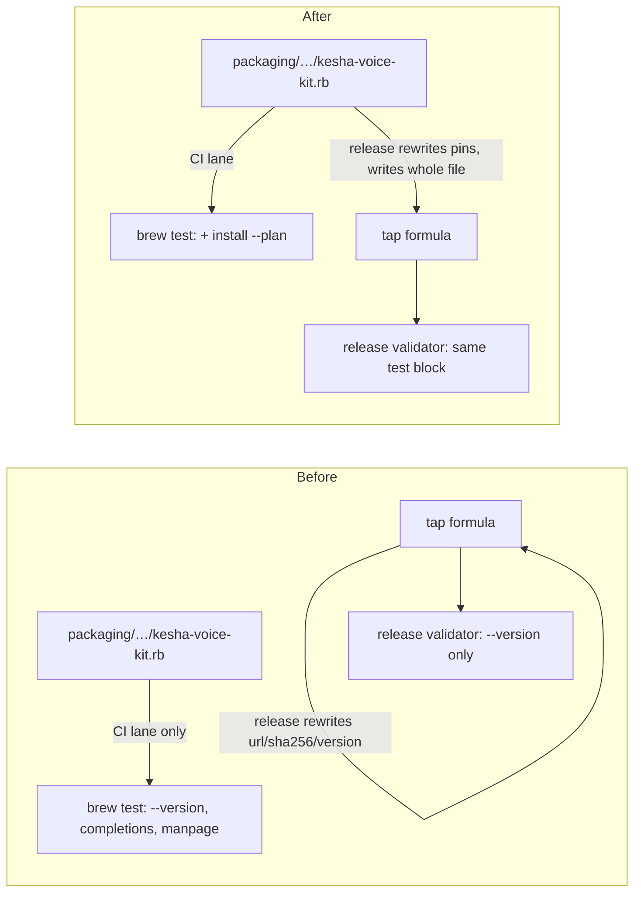

## Context

Three payloads ship the CLI as sources that Bun runs: the Homebrew formula (`libexec.install`), the `Dockerfile` (`COPY`), and `flake.nix` (`fileset` plus `cp -r`). Each one lists by hand what to stage. The CLI reads repository-root files only through static imports with an import attribute:

```
src/cli/completions.ts  ../../completions/kesha.{bash,zsh,fish}  type: "text"
src/cli/manpage.ts      ../../man/kesha.1                         type: "text"
src/install-plan.ts     ../model-plan.json                        type: "json"
src/voice-inventory.ts  ../model-plan.json                        type: "json"
src/package-info.ts     ../package.json                           type: "json"
```

Bun resolves these when the importing module loads, so an unstaged file fails the first command that loads that module. After #1412 that includes the main command, so `kesha --version` and `kesha --help` fail; subcommands loaded lazily, such as `completions`, still run.



## Decisions

**D1. The guard reads the imports, not a list.** `tests/unit/distribution-assets.test.ts` collects every relative import specifier in `src/**/*.ts` and `bin/*.js` that resolves outside `src/` and `bin/`, reduces each to its top-level entry (`completions`, `man`, `model-plan.json`, `package.json`), and asserts that the formula's `libexec.install` lines, the `Dockerfile` `COPY` lines, the `flake.nix` fileset and its `cp -r` line, and `package.json#files` each name it. Alternative: append `model-plan.json` to the hand list. Rejected, because a hand list is how #914 and #1429 both happened.

**D2. The formula test reads the asset.** `kesha install --plan` prints the plan from `model-plan.json` and `package.json` and exits 0. Run in a staged copy with an empty `HOME`, it wrote only Bun's transpiler cache and made no request, so it holds the "nothing downloads outside `kesha install`" invariant in a sandbox. It joins `--version`, `completions fish` and `manpage`, which catch a load failure only for their own modules.

**D3. The tap gets the whole in-repo formula.** `update-homebrew-tap.mjs` reads `packaging/homebrew/Formula/kesha-voice-kit.rb` from the checkout at the release tag, rewrites its pins with the existing `rewriteFormula`, and writes the result over the tap file. The tap's own body is discarded. Today it differs from the in-repo formula in exactly three places: no `completions`/`man`, the `parakeet` wrapper, and a `test do` that runs `parakeet --version`. `validate-homebrew-formula.sh` already runs `brew test` on the result, so the release now executes the full test block before `push-homebrew-tap.sh`.

## Risks

- **`parakeet` disappears for Homebrew users.** npm dropped it in #406 (v1.x, 2026-05-18), and the tap kept it only by drift. The release notes for the next stable release say so.
- **The import scan misses a dynamic import.** `git grep` finds no dynamic `import()` of a repository-root path today. A future one escapes D1 and fails at runtime instead.

## Open Questions

1. Should the maintainer patch `drakulavich/homebrew-tap` by hand now, so v2.1.0 Homebrew users get a working `kesha install` before the next release? The patch adds `"model-plan.json"` to the formula's `libexec.install` and leaves the pins alone.
